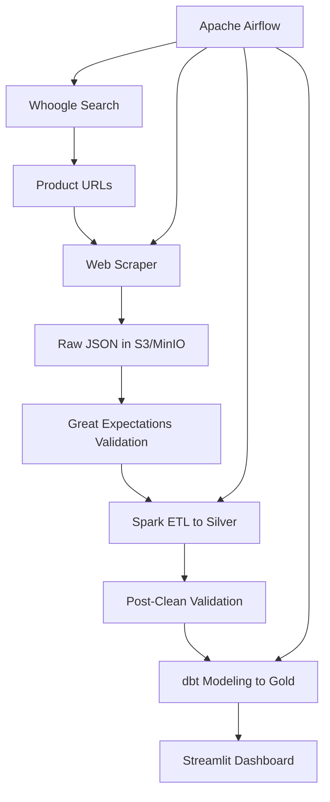

# 🚀 Web-Scraped Data Pipeline

[](https://github.com/yourusername/web-scraped-data-pipeline/actions/workflows/ci.yml)
[](https://opensource.org/licenses/MIT)
[](https://www.python.org/downloads/release/python-3100/)
[](https://spark.apache.org/)
[](https://airflow.apache.org/)

A comprehensive data engineering pipeline that uses Whoogle Search to find and scrape product data from e-commerce websites, validates it using modern data quality tools, transforms it with Apache Spark, models it with dbt, and visualizes insights through Streamlit.

## ✨ Features

- 🔍 **Privacy-Focused Scraping**: Uses Whoogle Search for ad-free, tracking-free web search
- 🛡️ **Data Quality**: Great Expectations for schema validation and quality monitoring
- ⚡ **Modern Stack**: Pandas 2.x, Pydantic 2.x, Great Expectations 0.18.x
- 🐳 **Containerized**: Complete Docker environment with all services
- 📊 **Real-time Dashboard**: Interactive Streamlit dashboard with product insights
- 🔄 **Orchestrated**: Apache Airflow for scheduling and workflow management
- 📈 **Scalable**: Apache Spark for large-scale data processing
- 🎯 **Production-Ready**: Industry best practices for data engineering

## 🏗️ Architecture



## 🛠️ Tech Stack

| Component | Technology | Version | Purpose |
|-----------|------------|---------|---------|
| **Web Scraping** | Whoogle Search + Python | Latest | Privacy-focused search and scraping |
| **Data Processing** | Apache Spark | 3.3.0 | Large-scale data transformation |
| **Data Quality** | Great Expectations | 0.16.13 | Schema validation and quality checks |
| **Data Modeling** | dbt | 1.5.1 | Transform data for analytics |
| **Orchestration** | Apache Airflow | 2.7.1 | Workflow scheduling and management |
| **Storage** | MinIO (local) / AWS S3 | Latest | Object storage for data lake |
| **Dashboard** | Streamlit | 1.25.0 | Interactive data visualization |
| **Database** | PostgreSQL | 13 | Airflow metadata storage |
| **Containerization** | Docker & Docker Compose | Latest | Environment consistency |

### Modern Python Stack
- **Pandas**: 2.0.3 (modern data manipulation)
- **PyArrow**: 12.0.1 (efficient data interchange)
- **Altair**: 5.0.1 (compatible with Great Expectations)
- **All packages**: Latest compatible versions

## 📁 Project Structure

```
web-scraped-data-pipeline/
├── 📂 dags/                          # Airflow DAGs
│   └── product_pipeline_dag.py      # Main pipeline orchestration
├── 📂 src/                           # Python source code
│   ├── scraper.py                   # Web scraping logic
│   ├── validate.py                  # Data validation with Great Expectations
│   ├── transform.py                 # Spark ETL processing
│   └── run_pipeline.py              # CLI entry point
├── 📂 contracts/                     # Data contracts
│   └── product_schema.json          # JSON Schema for validation
├── 📂 dbt_project/                   # dbt models and configuration
│   ├── models/
│   │   ├── dim_product.sql          # Product dimension table
│   │   └── fact_price_history.sql   # Price history fact table
│   ├── profiles.yml                 # dbt connection profiles
│   └── dbt_project.yml              # dbt project configuration
├── 📂 streamlit_app/                 # Dashboard application
│   └── dashboard.py                 # Main dashboard
├── 📂 great_expectations/            # Data quality configuration
│   ├── expectations/                # Validation rules
│   └── config/                      # Great Expectations config
├── 📂 data/                          # Local data storage
│   ├── raw/                         # Raw scraped data
│   ├── silver/                      # Cleaned and processed data
│   └── gold/                        # Modeled data for analytics
├── 🐳 docker-compose.yml            # Service orchestration
├── 🐳 Dockerfile                    # Container configuration
├── 📋 requirements.txt              # Python dependencies
└── 📖 README.md                     # This file
```

## 🚀 Quick Start

### Prerequisites

- **Docker & Docker Compose** (latest version)
- **8GB+ RAM** (recommended for Spark)
- **Git** (for cloning the repository)
- **Python 3.8+** (for local development)
- **pip3** (Python package manager)

### 1. Clone and Setup

```bash
# Clone the repository
git clone https://github.com/yourusername/web-scraped-data-pipeline.git
cd web-scraped-data-pipeline

# Install Python dependencies (for local development)
pip3 install -r requirements.txt

# Start all services
docker-compose up -d
```

### 2. Access Services

| Service | URL | Credentials | Purpose |
|---------|-----|-------------|---------|
| **Airflow** | http://localhost:8080 | admin/admin | Pipeline orchestration |
| **Streamlit Dashboard** | http://localhost:8501 | - | Data visualization |
| **MinIO Console** | http://localhost:9001 | minio/minio123 | Object storage management |
| **Spark Master UI** | http://localhost:8181 | - | Spark cluster monitoring |
| **Whoogle Search** | http://localhost:5000 | - | Privacy-focused search |

### 3. Run the Pipeline

#### Option A: Via Airflow UI
1. Open http://localhost:8080
2. Navigate to DAGs → `product_data_pipeline`
3. Click "Trigger DAG" to start the pipeline
4. Monitor execution in the Airflow UI

#### Option B: Via Command Line
```bash
# Run entire pipeline
docker-compose exec airflow-webserver python /opt/airflow/project/src/run_pipeline.py --stage all

# Run specific stages
docker-compose exec airflow-webserver python /opt/airflow/project/src/run_pipeline.py --stage scrape
docker-compose exec airflow-webserver python /opt/airflow/project/src/run_pipeline.py --stage validate
docker-compose exec airflow-webserver python /opt/airflow/project/src/run_pipeline.py --stage transform
```

## 🔧 Configuration

### Environment Variables

Create a `.env` file in the project root:

```bash
# Data Storage
USE_S3=false
S3_BUCKET=web-scraped-data-pipeline
LOCAL_DATA_PATH=./data

# Airflow
AIRFLOW_UID=50000

# MinIO (for local S3-compatible storage)
MINIO_ROOT_USER=minio
MINIO_ROOT_PASSWORD=minio123

# Whoogle Search
WHOOGLE_CONFIG_DISABLE_HTTPS=1
WHOOGLE_CONFIG_COUNTRY=US
```

### Customizing the Scraper

Edit `src/scraper.py` to customize scraping behavior:

```python
# Update search terms
PRODUCT_SEARCH_TERMS = [
    "best laptops 2024",
    "top rated smartphones",
    "wireless headphones reviews",
    # Add your search terms here
]
```

## 📊 Data Pipeline Flow

### 1. **Data Ingestion** (Raw Layer)
- Whoogle Search finds product URLs
- Web scraper extracts structured product data
- Data stored as JSON in `/raw/` directory

### 2. **Data Validation** (Quality Gate)
- Great Expectations validates against JSON Schema
- Checks for completeness, consistency, and uniqueness
- Failed records are logged for investigation

### 3. **Data Transformation** (Silver Layer)
- Apache Spark cleans and deduplicates data
- Normalizes product information
- Stores as Parquet format in `/silver/` directory

### 4. **Data Modeling** (Gold Layer)
- dbt creates dimensional models
- Builds `dim_product` and `fact_price_history` tables
- Optimized for analytics and reporting

### 5. **Data Visualization**
- Streamlit dashboard displays insights
- Interactive filtering and analysis
- Real-time data quality metrics

## 🔍 Data Quality with Great Expectations

The pipeline implements comprehensive data quality checks:

### Raw Data Validation
- **Schema Compliance**: Validates against JSON Schema contracts
- **Completeness**: Ensures required fields are present
- **Data Types**: Validates field types and formats
- **Value Ranges**: Checks for reasonable price ranges, ratings, etc.

### Post-Processing Validation
- **Uniqueness**: Ensures no duplicate products
- **Referential Integrity**: Validates relationships between tables
- **Business Rules**: Enforces domain-specific constraints

## 📈 Dashboard Features

The Streamlit dashboard provides:

- **📊 Product Analytics**: Price trends, rating distributions
- **🏷️ Brand Analysis**: Performance by brand
- **📦 Inventory Insights**: Stock status and availability
- **🔍 Advanced Filtering**: Filter by price, rating, brand, category
- **📈 Time Series**: Historical price and rating changes
- **🎯 Top Products**: Best-rated and most popular items

## 🐳 Docker Services

| Service | Image | Purpose | Port |
|---------|-------|---------|------|
| **whoogle** | benbusby/whoogle-search | Privacy-focused search | 5000 |
| **airflow-webserver** | apache/airflow:2.7.1 | Airflow UI | 8080 |
| **airflow-scheduler** | apache/airflow:2.7.1 | Pipeline scheduling | - |
| **postgres** | postgres:13 | Airflow metadata | 5432 |
| **minio** | minio/minio | S3-compatible storage | 9000, 9001 |
| **spark-master** | bde2020/spark-master:3.3.0-hadoop3.3 | Spark cluster master | 8181, 7077 |
| **spark-worker** | bde2020/spark-worker:3.3.0-hadoop3.3 | Spark worker nodes | 8182 |
| **spark-history-server** | bde2020/spark-history-server:3.3.0-hadoop3.3 | Spark job history | 18080 |
| **streamlit** | Custom Python image | Dashboard application | 8501 |

## 🛠️ Development

### Local Development Setup

```bash
# Create virtual environment
python3 -m venv venv
source venv/bin/activate  # On Windows: venv\Scripts\activate

# Install dependencies
pip install -r requirements.txt

# Run individual components
python src/scraper.py
python src/validate.py
python src/transform.py
```

### Troubleshooting

#### Common Issues

**1. Docker Memory Issues**
```bash
# Increase Docker memory limit
# Docker Desktop → Settings → Resources → Memory: 8GB+
```

**2. Port Conflicts**
```bash
# Check what's using a port
lsof -i :8080

# Stop conflicting services
sudo lsof -ti:8080 | xargs kill -9
```

**3. Service Not Starting**
```bash
# Check service logs
docker-compose logs airflow-webserver
docker-compose logs spark-master
```

## 📝 License

This project is licensed under the MIT License - see the [LICENSE](LICENSE) file for details.

## 🙏 Acknowledgments

- [Whoogle Search](https://github.com/benbusby/whoogle-search) for privacy-focused web search
- [Apache Airflow](https://airflow.apache.org/) for workflow orchestration
- [Apache Spark](https://spark.apache.org/) for distributed data processing
- [dbt](https://www.getdbt.com/) for data transformation
- [Great Expectations](https://greatexpectations.io/) for data quality validation
- [Streamlit](https://streamlit.io/) for the dashboard framework
- [MinIO](https://min.io/) for S3-compatible object storage
- [Big Data Europe](https://github.com/big-data-europe/docker-spark) for Spark Docker images

---

⭐ **Star this repository if you find it helpful!**
