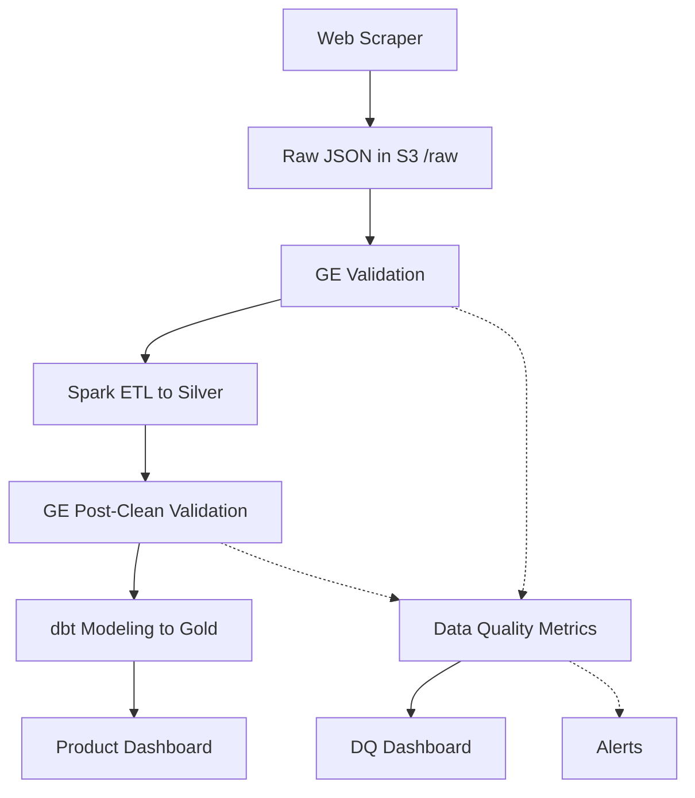

# Web-Scraped Data Ingestion Pipeline

## 🚀 Project Overview

This project demonstrates a complete data engineering pipeline that scrapes product data from e-commerce websites, validates it against schema contracts, transforms it using Apache Spark, models it with dbt, and visualizes insights through a Streamlit dashboard.

The pipeline implements industry best practices for data quality, observability, and reproducibility. It's containerized with Docker and orchestrated using Apache Airflow, making it easy to deploy in various environments.

## 🔧 Key Components

| Layer | Tool | Purpose |
|-------|------|---------|
| **Scraping** | Python (`requests`, `BeautifulSoup`) | Scrape structured HTML content |
| **Ingestion** | Python + Airflow | Load raw JSON to S3 `/raw/` |
| **Validation** | Great Expectations | Apply data contracts and rules |
| **Storage** | Amazon S3 (or MinIO) | Store raw, silver, and gold data |
| **Transformation** | PySpark | Clean, deduplicate, and normalize |
| **Modeling** | dbt | Build BI-ready tables (e.g. `dim_product`) |
| **Dashboarding** | Streamlit | Visualize key insights from `/gold/` |
| **Monitoring** | GE + Streamlit | Track data quality metrics |
| **Alerting** | Airflow + Slack/Email | Notify on quality issues |
| **Orchestration** | Airflow (via Docker) | Schedule and orchestrate entire flow |
| **Deployment** | Docker, Docker Compose | Run everything reproducibly |

## 🗂️ Directory Structure

```
web-scraped-data-pipeline/
├── dags/                      # Airflow DAGs
│   └── product_pipeline_dag.py
├── src/                       # Python source code
│   ├── scraper.py             # Web scraper
│   ├── validate.py            # Great Expectations runner
│   ├── transform.py           # Spark ETL
│   ├── run_pipeline.py        # CLI entrypoint
│   └── monitoring/            # Monitoring & alerting code
│       └── metrics.py         # Data quality metrics
├── contracts/                 # JSON Schema for contracts
│   └── product_schema.json
├── dbt_project/               # dbt models + config
│   ├── models/
│   │   ├── dim_product.sql
│   │   └── fact_price_history.sql
│   └── dbt_project.yml
├── streamlit_app/             # Dashboard code
│   ├── dashboard.py           # Product insights dashboard
│   └── dq_dashboard.py        # Data quality dashboard
├── great_expectations/        # GE config & expectations
│   └── expectations/          # Quality rule definitions
│       ├── raw/
│       │   ├── product_completeness_suite.json
│       │   ├── product_uniqueness_suite.json
│       │   └── product_consistency_suite.json
│       └── silver/
├── data/                      # Local data storage
│   ├── raw/
│   ├── silver/
│   ├── gold/
│   ├── metrics/               # Data quality metrics storage
│   └── reports/               # Data quality reports
├── docker-compose.yml
├── Dockerfile
├── requirements.txt
├── README.md
└── DATA_QUALITY_README.md     # Detailed monitoring documentation
```

## 🔄 Workflow Pipeline (End-to-End)



## 💻 Execution Plan

| Step | Tool | Output |
|------|------|--------|
| 1. Scrape product data | `scraper.py` | `products_YYYY-MM-DD.json` → S3 `/raw` |
| 2. Apply schema contract | GE + JSON Schema | Logs pass/fail for each field |
| 3. Clean + deduplicate | Spark | Parquet → S3 `/silver/` |
| 4. Post-clean validation | GE | Quality checks again |
| 5. dbt modeling | dbt CLI | `dim_product` in S3 `/gold/` |
| 6. Visualize insights | Streamlit | Interactive dashboard UI |
| 7. Track quality metrics | Custom monitoring | Quality metrics dashboard |
| 8. Orchestrate | Airflow DAG | Runs steps 1–7 automatically |

## 📊 Data Quality Monitoring

The pipeline includes robust data quality monitoring and alerting:

### Key Metrics Tracked
- **Schema Validation**: % of rows that fail schema checks
- **Critical Field Nulls**: # of nulls in critical fields
- **Schema Drift**: Detection of schema changes (new/removed columns)
- **Data Arrival Delay**: File not updated in last 24h
- **Record Count Anomaly**: 50% drop from historical average

### Alerting & Notification
- Fail Airflow DAG if validation fails
- Email/Slack alerts for data quality issues
- Quality metrics stored in S3/locally for dashboarding

For more details, see [DATA_QUALITY_README.md](DATA_QUALITY_README.md).

## 🛠️ Getting Started

### Prerequisites

- Docker and Docker Compose
- [Optional] AWS account for S3 deployment

### Running Locally

1. Clone the repository
```bash
git clone https://github.com/yourusername/web-scraped-data-pipeline.git
cd web-scraped-data-pipeline
```

2. Start the services using Docker Compose
```bash
docker-compose up -d
```

3. Access the services:
   - Airflow: http://localhost:8080 (username: admin, password: admin)
   - Product Dashboard: http://localhost:8501
   - Data Quality Dashboard: http://localhost:8502
   - MinIO Console: http://localhost:9001 (username: minio, password: minio123)
   - Spark Master UI: http://localhost:8181

4. Trigger the pipeline in Airflow or run manually:
```bash
# Run the entire pipeline
python src/run_pipeline.py --stage all

# Run a specific stage
python src/run_pipeline.py --stage transform
```

### Customizing the Scraper

To scrape a different website, edit `src/scraper.py` and update the selectors in the `scrape_product_details` function to match the target site's HTML structure.

## 🐳 Docker Setup

- **Dockerfile**: Handles Python + Spark + validation tooling
- **docker-compose.yml**: Sets up the complete environment with:
  - Airflow Scheduler/Webserver
  - MinIO (for S3 mocking)
  - Spark Master/Worker
  - Streamlit Apps (Product & DQ Dashboards)
  - dbt Runner

## 📊 Dashboard Features

### Product Analytics Dashboard
- Price trends over time
- Rating distribution by brand
- In-stock status analysis
- Top-rated products
- Filtering by price/rating/brand

### Data Quality Dashboard
- Schema validation success rate over time
- Critical field null counts tracking
- Schema drift visualization
- Data arrival delay monitoring
- Record count anomaly detection

## 🔍 Data Quality Validation

Great Expectations is used to enforce data quality at multiple stages:
- Raw data validation against JSON schema contracts
- Post-transformation validation of business rules
- Completeness, uniqueness, and consistency checks
- Automated alerting on validation failures
- Data quality reporting and monitoring

## 📦 Deployment Options

- **Local**: Docker Compose (included)
- **Cloud**: 
  - AWS: EC2 + S3 + EMR or Fargate
  - GCP: GCE + GCS + Dataproc
- **CI/CD-ready**: GitHub Actions, Airflow S3 sensor triggers

## 📝 License

This project is licensed under the MIT License - see the LICENSE file for details.

## 🙏 Acknowledgments

- Apache Airflow, Spark, and dbt communities
- Great Expectations team for data validation tools
- Streamlit for the dashboard framework
